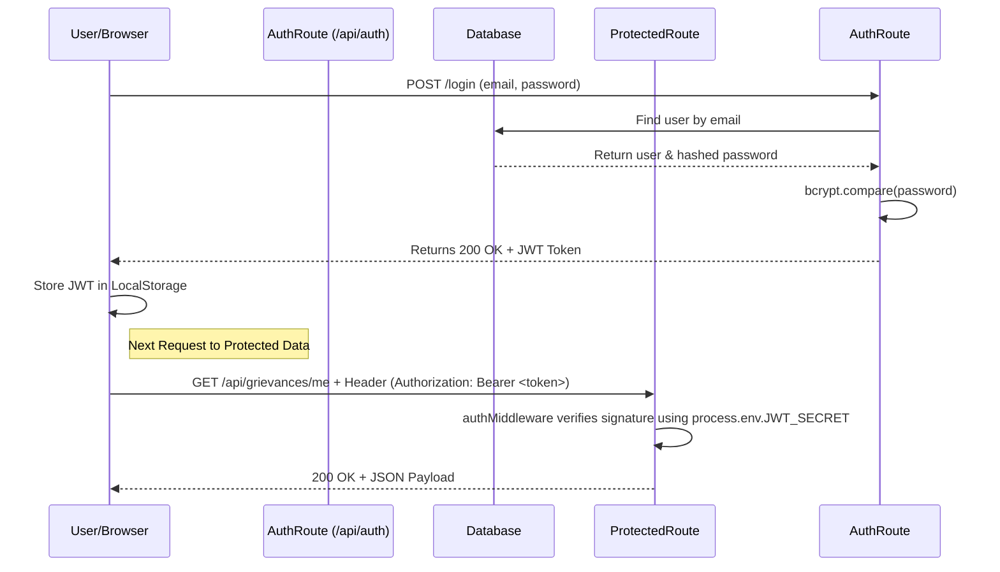
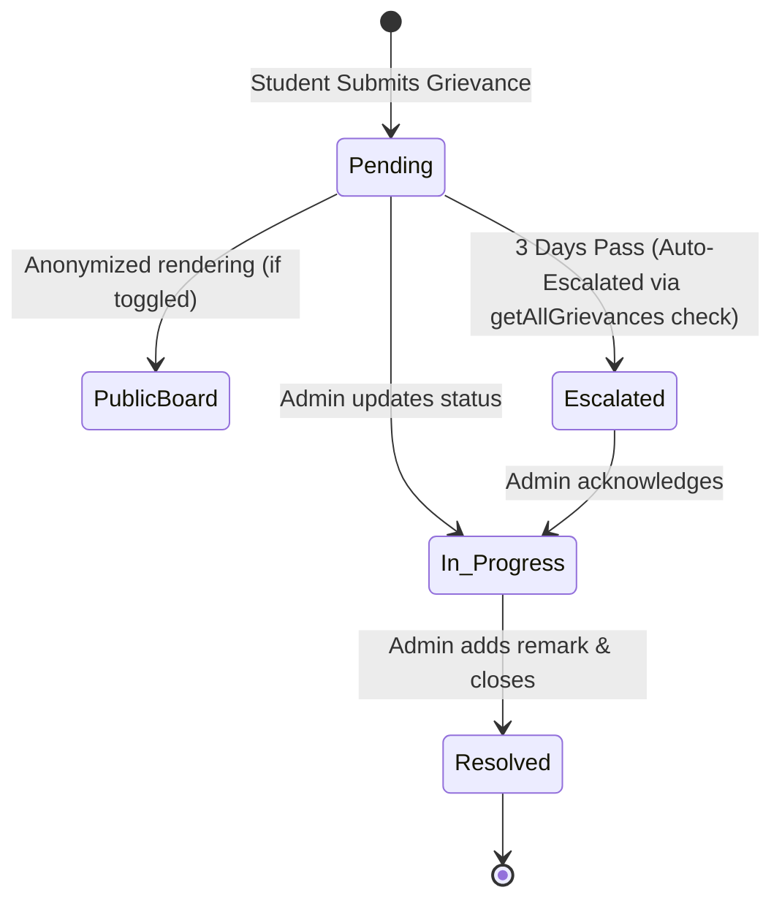

# 📖 Exhaustive Technical Reference Manual: Unified Campus Helpdesk & Portal

  

## 1. Executive Summary & Tech Stack

The **Unified Campus Helpdesk & Portal** is an enterprise-grade, full-stack web application engineered to digitize and secure campus administrative workflows. The system completely replaces legacy, paper-based reporting with a highly secure, centralized digital hub for Grievances, Hostel Outpasses, and Lost & Found items.

### **Technology Stack**
- **Frontend Layer:** React.js, Vite, Tailwind CSS (Glassmorphism), React Router DOM, React-Hot-Toast.
- **Backend API Layer:** Node.js, Express.js.
- **Database Layer:** MongoDB, Mongoose (ODM).
- **Security Protocols:** JSON Web Tokens (JWT), bcryptjs, Helmet (Header Security), express-mongo-sanitize (NoSQL Injection Prevention), express-rate-limit (DDoS Prevention).

---

## 2. System Architecture & Workflows

### **A. Authentication & JWT Validation Flow**
The application uses stateless, token-based authentication. When a user requests access to a protected route, the middleware intercepts and validates the token cryptographically.



### **B. The Grievance Lifecycle & Auto-Escalation**
The grievance module contains an active SLA (Service Level Agreement) tracker. If a ticket sits untouched for three days, the system automatically flags it as escalated during the next database retrieval phase.



---

## 3. Database Schema & Relationships (Deep Dive)

The system relies on a strictly typed, relational structure within a NoSQL environment utilizing **Mongoose**.

### **Foreign Keys (ObjectId References)**
The schema relies heavily on `mongoose.Schema.Types.ObjectId` to establish relationships between collections. Specifically, the `studentId` acts as a **Foreign Key** linking the `Grievance` and `Outpass` documents back to the `User` collection. When fetching data, Mongoose `.populate('studentId', 'name email')` is used to join the collections and merge the student's demographic data into the response object.

### **1. User Model**
The foundational identity layer.
- `name`, `email` (String, Unique)
- `password` (String, hashed via bcrypt)
- `role` (Enum: `student`, `admin`, Default: `student`)

### **2. Grievance Model**
- `studentId` (ObjectId, **Ref: User**)
- `title`, `description` (String)
- `category` (Enum: Academics, Hostel, Infrastructure, Mess/Cafeteria, Anti-Ragging, Other)
- `status` (Enum: `Pending`, `In Progress`, `Resolved`, Default: `Pending`)
- `isAnonymous` (Boolean): Determines if the `studentId` is stripped before public rendering.
- `isEscalated` (Boolean): Flagged dynamically if pending > 3 days.
- `upvotes` (Array of ObjectIds): Array of user IDs to enforce unique upvoting logic.

### **3. Outpass Model**
- `studentId` (ObjectId, **Ref: User**)
- `destination`, `reason` (String)
- `departureDate`, `returnDate` (Date)
- `status` (Enum: `Pending`, `Approved`, `Rejected`, Default: `Pending`)

### **4. LostItem Model**
- `itemName`, `description`, `contactInfo` (String)
- `type` (Enum: `Lost`, `Found`)
- `status` (Enum: `Open`, `Resolved`, Default: `Open`)
- `reportedBy` (ObjectId, **Ref: User**)

---

## 4. File-by-File Working Explanation

### **A. Backend Deep Dive**

#### **Controllers (`/controllers`)**
- **`authController.js`**: Handles identity generation. In `registerUser`, the logic intercepts the payload. If the route is triggered via the admin portal, it strictly checks `req.body.secretKey` against `process.env.ADMIN_SECRET`. If it matches, the `role` is elevated to `admin`.
- **`grievanceController.js`**: Houses the core logic of the application. 
  - `getAllGrievances`: Iterates through all database grievances. If `status === 'Pending'` and `createdAt` is older than `Date.now() - 3 days`, it forces `g.isEscalated = true` and runs `g.save()`.
  - `getPublicGrievances`: Strips `studentId._id` completely if `isAnonymous` is true.
  - `upvoteGrievance`: Utilizes `Array.some()` to verify if the incoming `req.user.id` already exists in the grievance's `upvotes` array. Rejects if true, preventing duplicate upvotes.
- **`outpassController.js` & `lostItemController.js`**: Standard CRUD controllers that parse `req.user.id` to attach the logged-in user to new documents.

#### **Middleware (`/middleware`)**
- **`authMiddleware.js` (`protect`)**: Extracts the Bearer token from headers. Uses `jwt.verify()` to cryptographically unpack the token payload. If valid, attaches the decoded `{ id, role }` to `req.user` and calls `next()`.
- **`adminMiddleware.js` (`isAdmin`)**: Placed *after* `protect` in the route chain. Evaluates `req.user.role === 'admin'`. If true, `next()` is called. If false, it returns `403 Forbidden` (IDOR attack prevention).

---

### **B. Frontend Deep Dive**

#### **Routing Configuration (`App.jsx`)**
Utilizes React Router DOM to manage the SPA environment. Contains a `<ProtectedRoute />` wrapper that aggressively checks `localStorage.getItem('token')`. If the token is missing, the component returns `<Navigate to="/login" />`, forcing the user to the auth page.

#### **Page Level (`/pages`)**
- **`StudentDashboard.jsx`**: The core authenticated component. Upon mounting (`useEffect`), it fires an Axios GET request to `/api/grievances/me`. The incoming JSON array maps into visually distinct UI cards. When a new grievance is submitted via the form, an Axios POST is triggered. Upon a 201 status, `react-hot-toast` fires `toast.success()`, and the state array is re-fetched to cause a dynamic DOM rerender.
- **`AdminDashboard.jsx`**: Similar mounting architecture, but calls the unrestricted `/api/grievances` (Admin-only route). The UI dynamically renders "Escalation" badges if the incoming JSON specifies `isEscalated: true`. It contains specialized logic to trigger `PUT` requests to manually update document statuses (`Resolved`, `Approved`, `Rejected`).

---

## 5. Security Hardening (Code Level)

The API is fortified against common enterprise-level attack vectors. The below configurations are mounted sequentially in `server.js`.

### **1. Express 5 / NoSQL Injection Prevention**
Because the system runs on Express 5.x, `req.query` is configured natively as a getter-only property. To allow the `express-mongo-sanitize` package to effectively intercept and scrub malicious NoSQL operators (`$`, `.`), an inline patch converts the query back to a writable descriptor before the sanitization middleware engages.

```javascript
// Parse JSON request bodies
app.use(express.json());

// Express 5 req.query Writable Patch
app.use((req, res, next) => {
  const query = req.query;
  Object.defineProperty(req, 'query', {
    value: query, writable: true, enumerable: true, configurable: true
  });
  next();
});

// Strips NoSQL Operators (e.g. $gt, $eq) from payloads
app.use(mongoSanitize());
```

### **2. Global & Strict Rate Limiting (DDoS & Spam Prevention)**
Rate limiting blocks automated bots from spamming the database or brute-forcing the login portals.

```javascript
// backend/middleware/rateLimiters.js
import rateLimit from 'express-rate-limit';

// Applied globally to the entire API layer
export const globalLimiter = rateLimit({
  windowMs: 15 * 60 * 1000, // 15 minutes
  max: 100, // Max 100 requests per IP
  message: 'Too many requests, please try again later.'
});

// Applied aggressively to Auth, Grievances, and Outpasses
export const strictLimiter = rateLimit({
  windowMs: 60 * 1000, // 1 minute
  max: 5, // Max 5 requests per minute
  message: 'Slow down. Please try again in a minute.'
});
```

### **3. HTTP Header Defense (Helmet)**
Mounted as `app.use(helmet());` in `server.js`, it automatically attaches 11 secure headers to every outgoing response, disabling `X-Powered-By`, enabling strict Transport Security, and blocking Cross-Site Scripting (XSS).

---

## 6. Local Installation & .env Setup

### **Step 1: Clone & Install Dependencies**
```bash
# Clone the repository
git clone https://github.com/your-username/unified-campus-portal.git
cd unified-campus-portal

# Install Backend
cd backend
npm install

# Install Frontend
cd ../frontend
npm install
```

### **Step 2: Configure Environment Variables**
Navigate to the `/backend` directory and create a `.env` file. Do not commit this file to version control.

```env
# /backend/.env
PORT=5000
MONGO_URI=mongodb+srv://<db_username>:<db_password>@cluster0.mongodb.net/campusDB
JWT_SECRET=super_secure_random_cryptographic_string_2026
ADMIN_SECRET=f47fd0b86b37207cc11368413e9a7798
```

### **Step 3: Run the Development Servers**

**Terminal 1 (Backend):**
```bash
cd backend
npm run dev
# Expected output: 🚀 Server running on http://localhost:5000
# Expected output: ✅ MongoDB Connected: cluster...
```

**Terminal 2 (Frontend):**
```bash
cd frontend
npm run dev
# Expected output: VITE vX.X.X ready in XXX ms
# Expected output: ➜  Local:   http://localhost:5173/
```

Access the frontend via `http://localhost:5173` to explore the complete Unified Campus Helpdesk ecosystem.
